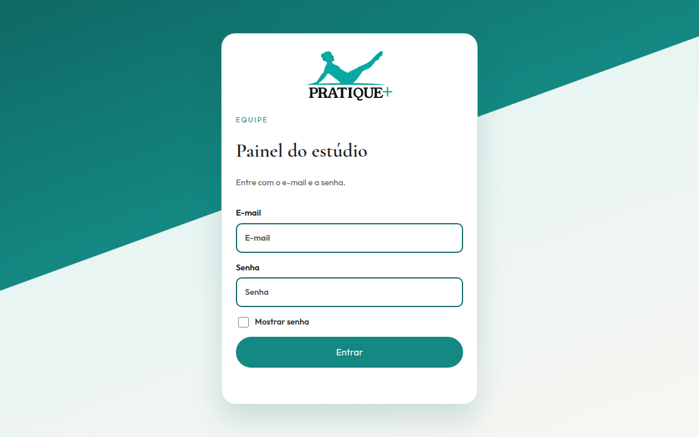

# Portfólio — Kauan Borges

Site pessoal com projetos, stack e currículo.

**Site:** [portifolio-bgkauan.vercel.app](https://portifolio-bgkauan.vercel.app/)

## Projetos

### Achei Buscador

CEP, feriados e bancos com React e BrasilAPI.

[Site](https://achei-buscador.vercel.app/) · [Código](https://github.com/kauanbg-dev/achei-buscador)

### BgConverter

Câmbio com cotação ao vivo, várias moedas e histórico.

[Site](https://bgconverter.vercel.app/) · [Código](https://github.com/kauanbg-dev/bgconverter)

### BG Finance

Receitas, despesas e autenticação.

[Site](https://bg-finance.onrender.com) · [Código](https://github.com/kauanbg-dev/bg-finance)

### Pratique + Pilates

Site institucional do estúdio.

[Site](https://pratique-pilates.vercel.app/) · [Código](https://github.com/kauanbg-dev/pratique-pilates)

### Pratique + Pilates — Sistema

Site público + painel administrativo com login, alunos, agenda e financeiro. Back-end serverless com banco de dados.

[Site](https://adm-pratique-pilates.vercel.app/) · [Código](https://github.com/kauanbg-dev/adm-pilates)

